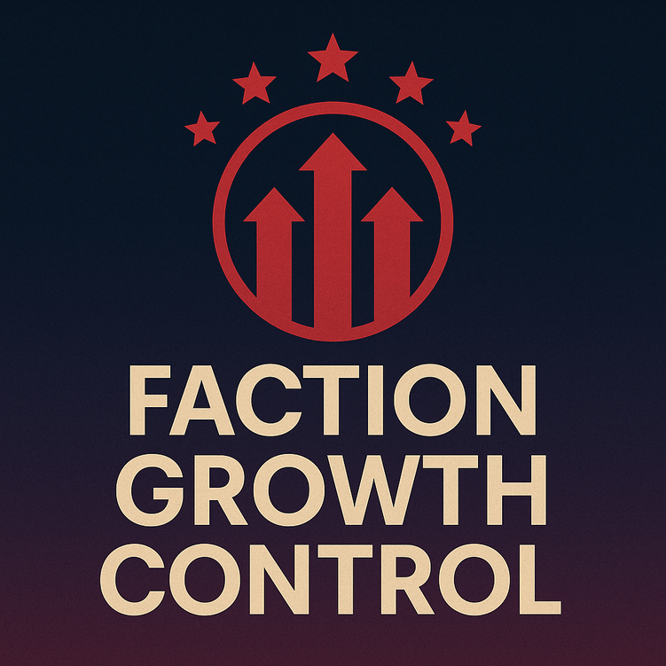

## Quasimorph FactionGrowthControl
  
Quasimorph mod for Faction Growth Control

Have you ever felt that faction balancing is off?
Can't explore Jupiter because you're afraid it'll trigger the endgame too early?
Isn't it frustrating when one monster faction steamrolls all the others in seconds?
Want to enjoy a long game without being stuck fighting just one dominant faction?

Try this mod.
It brings balanced, yet dynamic faction power progression—so you can play longer, explore more, and face evolving challenges.

## What this mod do

1. Modifies the default power cost and benefit of missions.
2. Modifies the success rate of missions that end due to time expiration.
3. Adjusts the amount of power gained and lost based on the number of stations each faction owns.
4. Limits the total number of missions to prevent excessive generation.

## Configuration

The configuration file will be created on the first game run and can be found at:  
`%AppData%\..\LocalLow\Magnum Scriptum Ltd\Quasimorph_ModConfigs\FactionGrowthControl\config.json`

If you're unsure about what the configuration options mean,  
a detailed explanation will be provided in a future update.

If you can't wait for future update, ask to your chatGPT.

## Thanks To

- Huy [https://github.com/HueyPixelBoxes] who made thumbnail of this mod
  It turned out much nicer than the AI-generated image I used before.
  Thumbnail by: huyphamquang2003 (Steam)
  https://steamcommunity.com/profiles/76561198934481958

- NBKRedSpy who made [QM_Template](https://github.com/NBKRedSpy/QM_Template)  
  This mod wouldn’t have been possible without it. FOR REAL.

- GatvinDev who made [MercenaryTraderLight](https://github.com/GatvinDev/MercenaryTraderLight/tree/master)  
  Some parts of this mod were developed with reference to GatvinDev’s code.
  And, I'm looking forward to the MercenaryTrader mod

## If you thanks to me
Just give a star to the mod's GitHub repository.
I'm unemployed. Seriously, it helps.

https://github.com/timesmoker/FactionGrowthControl

## QnA

Q. Non-steam version?  
A. Im working on it.

Q. No faction eliminination! 
A. Change config setting.

Q. Power's never going up high!  
A. FIXED – It now goes higher. If that's still not enough, you can tweak it in the config.
I'll upload a manual soon on how to make the faction more powerful.

## If You Have Question
I ain't good at English at all.  
So if you have question, please make your chatGPT trasnlate your words into Korean.

## What I just wanna say
This is my first mod.  
I hope it's good enough to make you happy.

Change Log

05-06-2025
Changed default config setting and it will be updated automatically. now power goes high enough.

Every single alphabet of this page is written by chatGPT.
